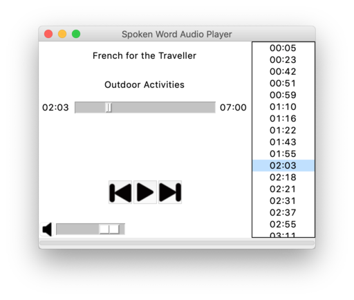

# SWAP
Spoken Word Audio Player

Why another MP3 player?  There were two motivations, both involving learning.  The
first is learning a language such as french which involves listening to lots of audio files 
and the second was wanting to a simple Python GUI project.

The idea for SWAP was born from the frustration when listening to foreign 
language audio files and wanting to listen to the same sentence a few times 
with no easy way of being able to replay the last spoken sentence.  Other 
audio players allow you to move forwards or backwards a fixed number of 
seconds or to manually move the pointer to the desired position which is 
not easy.

SWAP will scan an MP3 file and find the pauses between sentences and 
index these points.  This user can then easily skip forwards or backwards
sentence by sentence!

## Environment &amp; Dependencies

This application was developed in the following environment, though should work 
with any Python3 environment. 

- Python 3.7.3
- PyCharm CE 2019.1 
- Macos 10.14.5 

The required python dependencies for SWAP are the following: 

- **eyed3** for reading the MP3 metadata such as the title
- **mpg123** for playing an MP3 file
- **pydub** used to convert a MP3 into WAV format for analysis
- **scipy.io** for reading the WAV file
- **numpy** for analyzing the WAV file looking for the quiet periods between sentences
 
Also required are the [mpg123](https://www.mpg123.de/) libraries for your OS. 

## Development
The initial intention for this project was to create a simple GUI application in Python for 
learing purposes using the MVC pattern.  However, along the way issues were encounted and 
resolved with the actual playing of an MP3 file.

Initally pygame.mixer.music was used for the MP3 playback, but I struggled to get the seek 
functionality working correctly and accurately.  [mpg123](https://www.mpg123.de/) is now 
used for the playback, though it has a much lower level API and required wrapping some 
extra functions and managing the actual playback of reading MP3 frames and giving them to
the output decoder.

### Wrapping Dynamically Linked Libraries
The [mpg123.py](https://github.com/20tab/mpg123-python) module wraps the core functions 
required to play a MP3 file, but the application required the ability to *seek* to a specific 
point in the file.  Using the clearly written mpg123.py it was straight forward to wrap the 
extra required functions using the ctypes module.

### Threading
The analysis of a MP3 file can take some time.  To stop the UI locking up while this is 
happening, the analysis is executed on a background daemon thread and callbacks are used 
to communicate the results back.

 
## Special Mentions

As with any software projects, it draws from the work of others.  There are a few in 
particular whose gist examples and projects that were very helpful.

### Example Tkinter MVC Application
A great example of a simple Tkinter MVC application that has two windows 
and one model.  The Observer class is from this gist.

[MVC example in Python by cryptogun](https://gist.github.com/cryptogun/791b5bf7898114ec44e66d97fb8a7a7c)

### Spliting an audio file by the quiet bits
This gist shows how to split an audio file into segments depending on where the 
silence is.  This was used as the basis for the SegmentsAnalyzer class.  

[Split WAV files at silence by rudolfbyker](https://gist.github.com/rudolfbyker/8fc0d99ecadad0204813d97fee2c6c06)

### Creating a GitHub Python project
A simple example outline of a Python project on GitHub.

[somepackage by bast](https://github.com/bast/somepackage)

